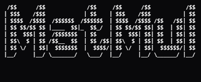

<p align="center">
  
  <p align="center">implement matrix multiplication op on 4x4(default) using systolic array</p>
</p>

## Intall
```bash
git clone git@github.com:0xhilSa/matmul.git
cd matmul
rm -rf .git .gitignore
make run
```

### Output
```bash
$ make run
Compiling Verilog files...
iverilog -o systolic_array_sim processing_elem.v systolic_array.v systolic_array_tb.v
Compilation complete!
Running simulation...
vvp systolic_array_sim
VCD info: dumpfile systolic_array.vcd opened for output.

=== Systolic Array Test ===
Matrix A:
  [  1   2   3   4 ]
  [  5   6   7   8 ]
  [  9  10  11  12 ]
  [ 13  14  15  16 ]

Matrix B:
  [  3   4   3   6 ]
  [  7   4   4   2 ]
  [  1   4   8   4 ]
  [  0   5   1   6 ]

Expected Result (C = A * B):
  [  20   44   39   46 ]
  [  64  112  103  118 ]
  [ 108  180  167  190 ]
  [ 152  248  231  262 ]

Actual Output:
  [   0    0    0    0 ]

=== Test Complete ===
```
